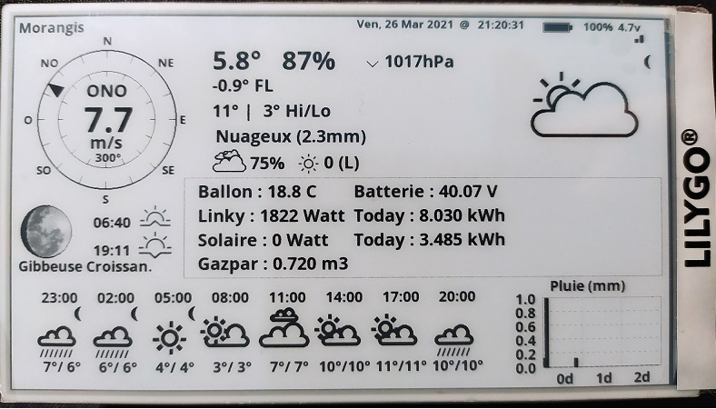

Weather display and Domoticz Values for Lilygo T5 4.7 inch e-paper v3 ( https://fr.aliexpress.com/premium/lilygo-t5.html ) 
=======================================

This is ** fork from project https://github.com/G6EJD/ESP32-e-Paper-Weather-Display by David Bird 2018** to work with ED097OC4 Kindle display and this driver.
**Please note that David Bird (https://github.com/G6EJD) owns the copyright to this software!** Only minor modifications where made for it to run with the epdiy driver.
THe  license details are outlined in **License.txt**.

Building It
-----------

 - Girst you need to install Arduino esp-idf as a component https://github.com/espressif/arduino-esp32/blob/master/docs/esp-idf_component.md (the easiest way is to put it into components folder of ESP-IDF)
 - Put Arduino JSON https://github.com/bblanchon/ArduinoJson into components/arduino/
 - Dont forget to insert your Wi-Fi settings and openweathermap API key into owm_credentials.h
 - Dont forget to insert your domoticz settings ainto domoticz.h
 - printing values with array :  {{"name","IDX","codeJson"},{"Prod","28","CounterToday"}, {} }  // {} --> free zone
		get the codeJson with http://domoticzserver/json.htm?type=devices&rid=yourIDX

- The driver and sample program are from [vroland/epdiy](https://github.com/vroland/epdiy) and [Xinyuan-LilyGO/LilyGo-EPD47](https://github.com/Xinyuan-LilyGO/LilyGo-EPD47/)

<h3 align = "left">Quick start:</h3>

- Install the [Arduino IDE](https://www.arduino.cc/en/Main/Software). Note: Later instructions may not work if you use Arduino via Flatpak.
- Install the latest [spressif/arduino-esp32](https://github.com/espressif/arduino-esp32) package in the IDE, version >= 1.05
- Download a zipfile from github using the "Download ZIP" button and install it using the IDE ("Sketch" -> "Include Library" -> "Add .ZIP Library...", OR:
- Clone this git repository into your sketchbook/libraries folder. For more info, see https://www.arduino.cc/en/Guide/Libraries
- Choose `ESP32 Dev Module` for the board
- Tools -> flash size -> `16M`
- Tools -> PSRAM -> `Enable`
- ("File" -> "Examples" -> "LilyGoEPD47" -> "demo") in the Arduino IDE
- Select the correct port and click upload
- Please refer to [Script Instructions](./scripts/README.MD) for picture and text generation 

# FAQ

- IO0 has been used and cannot be programmed.
- How to turn off the blue LED light?
    - To turn off the blue LED, you must call `epd_poweroff_all()`, which will turn off the entire power supply controlled by PWM_EN. Note that it cannot be turned off when powered by USB. It can only be turned off when powered by battery. For details, refer to `<examples/demo>`

Initial License
-------

This software, the ideas and concepts is Copyright (c) David Bird 2014 and beyond.

All rights to this software are reserved.
 
It is prohibited to redistribute or reproduce of any part or all of the software contents in any form other than the following:

 1. You may print or download to a local hard disk extracts for your personal and non-commercial use only.

 2. You may copy the content to individual third parties for their personal use, but only if you acknowledge the author David Bird as the source of the material.

 3. You may not, except with my express written permission, distribute or commercially exploit the content.

 4. You may not transmit it or store it in any other website or other form of electronic retrieval system for commercial purposes.

 5. You MUST include all of this copyright and permission notice ('as annotated') and this shall be included in all copies or substantial portions of the software and where the software use is visible to an end-user.
 
THE SOFTWARE IS PROVIDED "AS IS" FOR PRIVATE USE ONLY, IT IS NOT FOR COMMERCIAL USE IN WHOLE OR PART OR CONCEPT.

FOR PERSONAL USE IT IS SUPPLIED WITHOUT WARRANTY OF ANY KIND, EXPRESS OR IMPLIED, INCLUDING BUT NOT LIMITED TO THE WARRANTIES OF MERCHANTABILITY, FITNESS FOR A PARTICULAR PURPOSE AND NONINFRINGEMENT.

IN NO EVENT SHALL THE AUTHOR OR COPYRIGHT HOLDER BE LIABLE FOR ANY CLAIM, DAMAGES OR OTHER LIABILITY, WHETHER IN AN ACTION OF CONTRACT, TORT OR OTHERWISE, ARISING FROM, OUT OF OR IN CONNECTION WITH THE SOFTWARE OR THE USE OR OTHER DEALINGS IN THE SOFTWARE.
